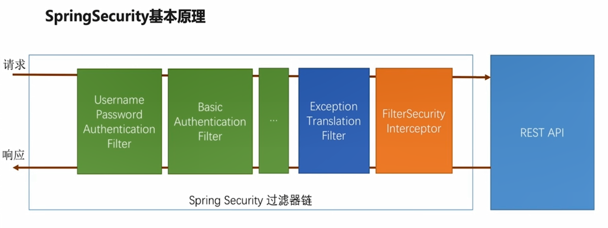
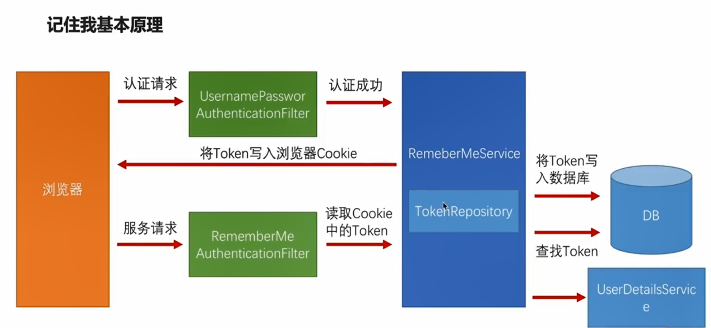

#  SpringSecurity学习笔记

## 前言

博客书

版本说明

```properties
platform-bom=Cairo-SR7
spring-cloud-dependencies=Finchley.SR4
```

相关链接

* SpringSecurity 官网： https://spring.io/projects/spring-security
* SpringSecurity 官方文档： https://docs.spring.io/spring-security/site/docs/5.2.2.BUILD-SNAPSHOT/reference/htmlsingle/
* maven 地址：https://mvnrepository.com/artifact/org.springframework.security/spring-security-web
* maven 地址：https://mvnrepository.com/artifact/org.springframework.security/spring-security-config
* maven 地址：https://mvnrepository.com/artifact/org.springframework.boot/spring-boot-starter-security

## SpringSecurity 核心功能

1. 认证
2. 授权
3. 攻击防护

## SpringSecurity 基本原理



## 自定义 SpringSecurity

### SpringSecurity 核心配置

1. 定义 `SpringSecurityCoreConfig` 需要继承 `org.springframework.security.config.annotation.web.configuration.WebSecurityConfigurerAdapter` 
2. 在 `SpringSecurityCoreConfig` 添加注解 `@EnableWebSecurity` ，该类可以使用 `SpringSecurity` 配置和扩展 `SpringSecurity` 
3. 简单配置后（使用 SpringSecurity 默认配置项），启动项目，SpringSeucirty 默认用户为 `user`， 密码控制台自动生成，可以搜索 `Using generated security password` 查询密码；

```java
package top.simba1949.config.security;

import org.springframework.security.config.annotation.web.configuration.EnableWebSecurity;
import org.springframework.security.config.annotation.web.configuration.WebSecurityConfigurerAdapter;

/**
 * @EnableWebSecurity 开启使用 SpringSecurity
 *
 * @AUTHOR Theodore
 * @DATE 2019/12/30 9:49
 */
@EnableWebSecurity
public class SpringSecurityCoreConfig extends WebSecurityConfigurerAdapter {
    // 使用 SpringSecurity 默认配置
}
```

### 简单自定义用户名和密码配置

application.yml 配置文件

```yaml
spring:
  security:
    # 简单配置用户信息
    user:
      name: user
      password: password
```

### 自定义用户认证流程逻辑

1. 创建一个类（示例：`MyUserDetailsService`），实现 `org.springframework.security.core.userdetails.UserDetailsService` 接口，重写 `loadUserByUsername` 方法
2. 自定义用户名和密码
3. 在 `SpringSecurityCoreConfig` 配置加密方式

SpringSecurityCoreConfig 类

```java
package top.simba1949.config.security;

import org.springframework.context.annotation.Bean;
import org.springframework.security.config.annotation.web.configuration.EnableWebSecurity;
import org.springframework.security.config.annotation.web.configuration.WebSecurityConfigurerAdapter;
import org.springframework.security.crypto.bcrypt.BCryptPasswordEncoder;
import org.springframework.security.crypto.password.PasswordEncoder;

/**
 * @EnableWebSecurity 开启使用 SpringSecurity
 *
 * @AUTHOR Theodore
 * @DATE 2019/12/30 9:49
 */
@EnableWebSecurity
public class SpringSecurityCoreConfig extends WebSecurityConfigurerAdapter {
    // 使用 SpringSecurity 默认配置

    /**
     * 配置加密方式
     * @return
     */
    @Bean
    public PasswordEncoder passwordEncoder(){
        return new BCryptPasswordEncoder(16);
    }
}
```

MyUserDetailsService 类

```java
package top.simba1949.config.security;

import lombok.extern.slf4j.Slf4j;
import org.springframework.beans.factory.annotation.Autowired;
import org.springframework.security.core.authority.AuthorityUtils;
import org.springframework.security.core.userdetails.User;
import org.springframework.security.core.userdetails.UserDetails;
import org.springframework.security.core.userdetails.UserDetailsService;
import org.springframework.security.core.userdetails.UsernameNotFoundException;
import org.springframework.security.crypto.password.PasswordEncoder;
import org.springframework.stereotype.Component;

/**
 * 自定义 SpringSecurity 认证流程
 * 
 * @AUTHOR Theodore
 * @DATE 2019/12/30 10:42
 */
@Slf4j
@Component
public class MyUserDetailsService implements UserDetailsService {

    @Autowired
    private PasswordEncoder passwordEncoder;

    @Override
    public UserDetails loadUserByUsername(String username) throws UsernameNotFoundException {
        log.info("登录用户名：{}", username);
        // 根据用户名去数据库中查询用户信息包括密码
        String password = passwordEncoder.encode("password");
        log.info("从数据库中查询的密码为：{}", password);

        // 根据用户名去数据查询用户的信息，判断用户是否启用，账号是否过期，密码是否过期，账号是否没有冻结
        // 用户是否启用
        boolean enabled = true;
        // 账号是否没有过期
        boolean accountNonExpired = true;
        // 密码是否过期
        boolean credentialsNonExpired = true;
        // 账号是否没有冻结
        boolean accountNonLocked = true;

        // 第一个参数表示用户名，第二个参数表示加密后的密码，最后一个个参数表示该用户拥有哪些权限
        return new User(username, password, enabled, accountNonExpired, credentialsNonExpired, accountNonLocked,
            AuthorityUtils.commaSeparatedStringToAuthorityList("admin"));
    }
}
```

### 自定义用户登录页面

1. 创建一个自定义登陆页面 `login.html`
2. 在 `SpringSecurityCoreConfig` 类，添加如下配置

自定义登陆页面

```html
<!DOCTYPE html>
<html lang="en">
<head>
    <meta charset="UTF-8">
    <title>自定义登录页面</title>
</head>
<body>
<h1>自定义登录页面</h1>
<!--/user/login 是自定义处理登录的uri-->
<form action="/user/login" method="post">
    <table>
        <tr> <td>用户名：</td><td><input type="text" name="username"></td></tr>
        <tr> <td>密 码：</td><td><input type="password" name="password"></td></tr>
        <tr> <td><button type="submit">登录</button></tr>
    </table>
</form>
</body>
</html>
```

SpringSecurityCoreConfig 配置自定义登录页面和处理登录的URI

```java
package top.simba1949.config.security;

import org.springframework.context.annotation.Bean;
import org.springframework.security.config.annotation.web.builders.HttpSecurity;
import org.springframework.security.config.annotation.web.configuration.EnableWebSecurity;
import org.springframework.security.config.annotation.web.configuration.WebSecurityConfigurerAdapter;
import org.springframework.security.crypto.bcrypt.BCryptPasswordEncoder;
import org.springframework.security.crypto.password.PasswordEncoder;

/**
 * @EnableWebSecurity 开启使用 SpringSecurity
 *
 * @AUTHOR Theodore
 * @DATE 2019/12/30 9:49
 */
@EnableWebSecurity
public class SpringSecurityCoreConfig extends WebSecurityConfigurerAdapter {

    @Override
    protected void configure(HttpSecurity http) throws Exception {
        http
            // form 表单登录
            .formLogin()
            // 自定义登录页面
            .loginPage("/login.html")
            // 自定义处理登录的uri，但是处理还是由SpringSecurity的UsernamePasswordAuthenticationFilter 进行获取用户名和密码，
            // 交给 MyUserDetailsService处理，这里只是个性化定制
             .loginProcessingUrl("/user/login")
            .and()
            // 设置基于 HttpServletRequest 请求配置
            .authorizeRequests()
            // 匹配 antMatchers 里的对应 uri，直接放行，防止进入登录页面不断重定向
            .antMatchers("/login.html", "/user/login").permitAll()
            .anyRequest()
            .authenticated()
            .and()
            // 禁用跨站请求防护
            .csrf()
            .disable()
        ;
    }

    /**
     * 配置加密方式
     * @return
     */
    @Bean
    public PasswordEncoder passwordEncoder(){
        return new BCryptPasswordEncoder(16);
    }
}
```

### 自定义用户登录成功后处理逻辑

备注：SpringSecurity 默认用户登录成功后进入用户上一次登录的URL

1. 首先需要实现 `org.springframework.security.web.authentication.AuthenticationSuccessHandler` 接口或者继承 `org.springframework.security.web.authentication.SavedRequestAwareAuthenticationSuccessHandler` 类，重写 `onAuthenticationSuccess` 方法，根据业务需求处理
2. 在 `SpringSecurityCoreConfig` 中配置自定义登录成功处理的类

定义认证成功处理逻辑

```java
package top.simba1949.config.security;

import lombok.extern.slf4j.Slf4j;
import org.springframework.security.core.Authentication;
import org.springframework.security.web.authentication.SavedRequestAwareAuthenticationSuccessHandler;
import org.springframework.security.web.savedrequest.HttpSessionRequestCache;
import org.springframework.security.web.savedrequest.RequestCache;
import org.springframework.security.web.savedrequest.SavedRequest;
import org.springframework.stereotype.Component;

import javax.servlet.ServletException;
import javax.servlet.http.HttpServletRequest;
import javax.servlet.http.HttpServletResponse;
import java.io.IOException;

/**
 * 自定义认证成功后业务处理逻辑
 *
 * @AUTHOR Theodore
 * @DATE 2019/12/30 14:23
 */
@Slf4j
@Component(value = "authenticationSuccessHandler")
public class MyAuthenticationSuccessHandler extends SavedRequestAwareAuthenticationSuccessHandler {

    /**
     * HttpSessionRequestCache 存储用户上次访问的url
     */
    private RequestCache requestCache = new HttpSessionRequestCache();

    @Override
    public void onAuthenticationSuccess(HttpServletRequest request, HttpServletResponse response, Authentication authentication) throws IOException, ServletException {
        // 记录用户登录ip、时间等或者其他业务处理逻辑
        log.info("用户登录成功后的业务处理逻辑");
        // 自己获取用户上一次登录url，然后实行跳转
        // 和调用父类方法同样效果哈
        SavedRequest savedRequest = requestCache.getRequest(request, response);
        String targetUrl = savedRequest.getRedirectUrl();
        getRedirectStrategy().sendRedirect(request, response, targetUrl);
        // 调用父类的方法，跳转到用户上次登录url中
        // super.onAuthenticationSuccess(request, response, authentication);
    }
}
```

配置自定义认证处理逻辑

```java
package top.simba1949.config.security;

import org.springframework.beans.factory.annotation.Autowired;
import org.springframework.context.annotation.Bean;
import org.springframework.security.config.annotation.web.builders.HttpSecurity;
import org.springframework.security.config.annotation.web.configuration.EnableWebSecurity;
import org.springframework.security.config.annotation.web.configuration.WebSecurityConfigurerAdapter;
import org.springframework.security.crypto.bcrypt.BCryptPasswordEncoder;
import org.springframework.security.crypto.password.PasswordEncoder;
import org.springframework.security.web.authentication.AuthenticationSuccessHandler;

/**
 * @EnableWebSecurity 开启使用 SpringSecurity
 *
 * @AUTHOR Theodore
 * @DATE 2019/12/30 9:49
 */
@EnableWebSecurity
public class SpringSecurityCoreConfig extends WebSecurityConfigurerAdapter {

    @Autowired
    private AuthenticationSuccessHandler authenticationSuccessHandler;

    @Override
    protected void configure(HttpSecurity http) throws Exception {
        http
            // form 表单登录
            .formLogin()
            // 自定义登录页面
            .loginPage("/login.html")
            // 自定义处理登录的uri，但是处理还是由SpringSecurity的UsernamePasswordAuthenticationFilter 进行获取用户名和密码，
            // 交给 MyUserDetailsService处理，这里只是个性化定制
             .loginProcessingUrl("/user/login")
            // 配置自定义登录成功后的业务处理逻辑
            // .successHandler(new MyAuthenticationSuccessHandler())
            // 和上面直接 new 同样效果，不推荐使用 new，充分利用 spring 容器
            .successHandler(authenticationSuccessHandler)
            .and()
            // 设置基于 HttpServletRequest 请求配置
            .authorizeRequests()
            // 匹配 antMatchers 里的对应 uri，直接放行，防止进入登录页面不断重定向
            .antMatchers("/login.html", "/user/login").permitAll()
            .anyRequest()
            .authenticated()
            .and()
            // 禁用跨站请求防护
            .csrf()
            .disable()
        ;
    }

    /**
     * 配置加密方式
     * @return
     */
    @Bean
    public PasswordEncoder passwordEncoder(){
        return new BCryptPasswordEncoder(16);
    }
}
```

### 自定义用户登录失败后处理逻辑

1. 首先需要实现 `org.springframework.security.web.authentication.AuthenticationFailureHandler` 接口或者继承`org.springframework.security.web.authentication.SimpleUrlAuthenticationFailureHandler` 类，重写 `onAuthenticationFailure` 方法
2. 配置自定义登录失败处理的类

定义认证失败处理逻辑

```java
package top.simba1949.config.security;

import lombok.extern.slf4j.Slf4j;
import org.springframework.http.HttpStatus;
import org.springframework.security.core.AuthenticationException;
import org.springframework.security.web.authentication.SimpleUrlAuthenticationFailureHandler;
import org.springframework.stereotype.Component;

import javax.servlet.ServletException;
import javax.servlet.http.HttpServletRequest;
import javax.servlet.http.HttpServletResponse;
import java.io.IOException;

/**
 * 自定义认证失败处理逻辑
 *
 * @AUTHOR Theodore
 * @DATE 2019/12/30 14:40
 */
@Slf4j
@Component("authenticationFailureHandler")
public class MyAuthenticationFailureHandler extends SimpleUrlAuthenticationFailureHandler {

    @Override
    public void onAuthenticationFailure(HttpServletRequest request, HttpServletResponse response, AuthenticationException exception) throws IOException, ServletException {
        log.info("用户认证失败后的业务处理逻辑");
        // 使用 response 写给前端
        response.setStatus(HttpStatus.INTERNAL_SERVER_ERROR.value());
        response.setContentType("application/json;charset=utf-8");
        response.getWriter().write("认证失败啦，请重新认证");
        // SpringSecurity 默认跳转到提交认证的页面
        // super.onAuthenticationFailure(request, response, exception);
    }
}
```

SpringSecurityCoreConfig 配置自定义登录页面和处理登录的URI

```java
package top.simba1949.config.security;

import org.springframework.beans.factory.annotation.Autowired;
import org.springframework.context.annotation.Bean;
import org.springframework.security.config.annotation.web.builders.HttpSecurity;
import org.springframework.security.config.annotation.web.configuration.EnableWebSecurity;
import org.springframework.security.config.annotation.web.configuration.WebSecurityConfigurerAdapter;
import org.springframework.security.crypto.bcrypt.BCryptPasswordEncoder;
import org.springframework.security.crypto.password.PasswordEncoder;
import org.springframework.security.web.authentication.AuthenticationFailureHandler;
import org.springframework.security.web.authentication.AuthenticationSuccessHandler;

/**
 * @EnableWebSecurity 开启使用 SpringSecurity
 *
 * @AUTHOR Theodore
 * @DATE 2019/12/30 9:49
 */
@EnableWebSecurity
public class SpringSecurityCoreConfig extends WebSecurityConfigurerAdapter {

    @Autowired
    private AuthenticationSuccessHandler authenticationSuccessHandler;

    @Autowired
    private AuthenticationFailureHandler authenticationFailureHandler;

    @Override
    protected void configure(HttpSecurity http) throws Exception {
        http
            // form 表单登录
            .formLogin()
            // 自定义登录页面
            .loginPage("/login.html")
            // 自定义处理登录的uri，但是处理还是由SpringSecurity的UsernamePasswordAuthenticationFilter 进行获取用户名和密码，
            // 交给 MyUserDetailsService处理，这里只是个性化定制
             .loginProcessingUrl("/user/login")
            // 配置自定义登录成功后的业务处理逻辑
            // .successHandler(new MyAuthenticationSuccessHandler())
            // 和上面直接 new 同样效果，不推荐使用 new，充分利用 spring 容器
            .successHandler(authenticationSuccessHandler)
            // 配置自定义认证失败后的业务处理逻辑
            .failureHandler(authenticationFailureHandler)
            .and()
            // 设置基于 HttpServletRequest 请求配置
            .authorizeRequests()
            // 匹配 antMatchers 里的对应 uri，直接放行，防止进入登录页面不断重定向
            .antMatchers("/login.html", "/user/login").permitAll()
            .anyRequest()
            .authenticated()
            .and()
            // 禁用跨站请求防护
            .csrf()
            .disable()
        ;
    }

    /**
     * 配置加密方式
     * @return
     */
    @Bean
    public PasswordEncoder passwordEncoder(){
        return new BCryptPasswordEncoder(16);
    }
}
```

### 获取当前用户信息

```java
package top.simba1949.controller;

import org.springframework.security.core.Authentication;
import org.springframework.security.core.annotation.AuthenticationPrincipal;
import org.springframework.security.core.context.SecurityContextHolder;
import org.springframework.security.core.userdetails.UserDetails;
import org.springframework.web.bind.annotation.GetMapping;
import org.springframework.web.bind.annotation.RequestMapping;
import org.springframework.web.bind.annotation.RestController;

/**
 * 获取当前用户信息
 * 
 * @AUTHOR Theodore
 * @DATE 2019/12/30 15:02
 */
@RestController
@RequestMapping("user")
public class UserController {

    @GetMapping("me0")
    public Authentication authentication(){
        return SecurityContextHolder.getContext().getAuthentication();
    }

    @GetMapping("me1")
    public Authentication authentication(Authentication authentication){
        return authentication;
    }

    @GetMapping("me2")
    public UserDetails authentication(@AuthenticationPrincipal UserDetails userDetails){
        return userDetails;
    }
}
```

### 记住我

#### 记住我基本原理



前端 ***记住我*** 的 **name** 为 **`remember-me` ** 

1. 配置 `PersistentTokenRepository` 类的 `bean` 
2. 注入 `UserDetailsService` ，并设置
3. 在 `SpringSecurityCoreConfig` 的配置类添加配置

配置 PersistentTokenRepository，注入 `UserDetailsService` ，在 `SpringSecurityCoreConfig` 添加配置

```java
package top.simba1949.config.security;

import org.springframework.beans.factory.annotation.Autowired;
import org.springframework.beans.factory.annotation.Qualifier;
import org.springframework.context.annotation.Bean;
import org.springframework.security.config.annotation.web.builders.HttpSecurity;
import org.springframework.security.config.annotation.web.configuration.EnableWebSecurity;
import org.springframework.security.config.annotation.web.configuration.WebSecurityConfigurerAdapter;
import org.springframework.security.core.userdetails.UserDetailsService;
import org.springframework.security.crypto.bcrypt.BCryptPasswordEncoder;
import org.springframework.security.crypto.password.PasswordEncoder;
import org.springframework.security.web.authentication.AuthenticationFailureHandler;
import org.springframework.security.web.authentication.AuthenticationSuccessHandler;
import org.springframework.security.web.authentication.rememberme.JdbcTokenRepositoryImpl;
import org.springframework.security.web.authentication.rememberme.PersistentTokenRepository;

import javax.sql.DataSource;

/**
 * @EnableWebSecurity 开启使用 SpringSecurity
 *
 * @AUTHOR Theodore
 * @DATE 2019/12/30 9:49
 */
@EnableWebSecurity
public class SpringSecurityCoreConfig extends WebSecurityConfigurerAdapter {

    @Autowired
    private AuthenticationSuccessHandler authenticationSuccessHandler;

    @Autowired
    private AuthenticationFailureHandler authenticationFailureHandler;
    /**
     * 注入自定义认证流程
     */
    @Autowired
    @Qualifier("myUserDetailsService")
    private UserDetailsService userDetailsService;

    @Autowired
    private DataSource dataSource;

    /**
     * 定义 token 存储方式，示例使用功能 <b>数据库存储</b>
     * @return
     */
    @Bean
    public PersistentTokenRepository persistentTokenRepository(){
        JdbcTokenRepositoryImpl tokenRepository = new JdbcTokenRepositoryImpl();
        tokenRepository.setDataSource(dataSource);
        // 启动时候自动创建 tokenRepository 需要的表结构，第一次启动时可以配置为true，以后不能配置为true
        // 或者进入 JdbcTokenRepositoryImpl 类，执行类中对应的SQL，下面一行设置为false或者删除即可
        tokenRepository.setCreateTableOnStartup(false);
        return tokenRepository;
    }

    @Override
    protected void configure(HttpSecurity http) throws Exception {
        http
            // form 表单登录
            .formLogin()
            // 自定义登录页面
            .loginPage("/login.html")
            // 自定义处理登录的uri，但是处理还是由SpringSecurity的UsernamePasswordAuthenticationFilter 进行获取用户名和密码，
            // 交给 MyUserDetailsService处理，这里只是个性化定制
             .loginProcessingUrl("/user/login")
            // 配置自定义登录成功后的业务处理逻辑
            // .successHandler(new MyAuthenticationSuccessHandler())
            // 和上面直接 new 同样效果，不推荐使用 new，充分利用 spring 容器
            .successHandler(authenticationSuccessHandler)
            // 配置自定义认证失败后的业务处理逻辑
            .failureHandler(authenticationFailureHandler)
            .and()
            // 记住我配置：其实remember-me功能是将token存储起来，
            // 在未过期时，用户打开浏览器 remember-me 的 cookie还存在，后台自动捕捉到并登录，只是用户无感知而已
            .rememberMe()
            // 设置 token 存储位置
            .tokenRepository(persistentTokenRepository())
            // 设置 token 过期时间
            .tokenValiditySeconds(60)
            // 设置自定义认证流程，记住我时最终拿到对应token去userDetailsService做认证
            .userDetailsService(userDetailsService)
            .and()
            // 设置基于 HttpServletRequest 请求配置
            .authorizeRequests()
            // 匹配 antMatchers 里的对应 uri，直接放行，防止进入登录页面不断重定向
            .antMatchers("/login.html", "/user/login").permitAll()
            .anyRequest()
            .authenticated()
            .and()
            // 禁用跨站请求防护
            .csrf()
            .disable()
        ;
    }

    /**
     * 配置加密方式
     * @return
     */
    @Bean
    public PasswordEncoder passwordEncoder(){
        return new BCryptPasswordEncoder(16);
    }
}
```

### 自定义登出后处理逻辑

SpringSecurity 默认访问：`/logout` 路径即为退出，

SpringSecurity 登出之后会做如下：

1. 使当前的 session 失效
2. 清楚与当前用户相关的 remember-me 记录
3. 清空当前的 SecurityContext
4. 重定向到登录页面

实现自定义退出成功后业务逻辑

1. 自定义退出成功类 `MyLogoutSuccessHandler`，实现 `org.springframework.security.web.authentication.logout.LogoutSuccessHandler` 接口或者基础 `org.springframework.security.web.authentication.logout.SimpleUrlLogoutSuccessHandler`，重写 `onLogoutSuccess` 方法
2. 在 `SpringSecurityCoreConfig` 中配置

MyLogoutSuccessHandler 自定义退成成功业务

```java
package top.simba1949.config.security;

import lombok.extern.slf4j.Slf4j;
import org.springframework.security.core.Authentication;
import org.springframework.security.web.DefaultRedirectStrategy;
import org.springframework.security.web.RedirectStrategy;
import org.springframework.security.web.authentication.logout.SimpleUrlLogoutSuccessHandler;
import org.springframework.stereotype.Component;

import javax.servlet.ServletException;
import javax.servlet.http.HttpServletRequest;
import javax.servlet.http.HttpServletResponse;
import java.io.IOException;

/**
 * 自定义退出成功后业务逻辑
 *
 * @AUTHOR Theodore
 * @DATE 2019/12/30 15:33
 */
@Slf4j
@Component
public class MyLogoutSuccessHandler extends SimpleUrlLogoutSuccessHandler {
    /**
     * Spring 封装的重定向
     */
    private RedirectStrategy redirectStrategy = new DefaultRedirectStrategy();

    @Override
    public void onLogoutSuccess(HttpServletRequest request, HttpServletResponse response, Authentication authentication) throws IOException, ServletException {
        // 比如记录日志，根据自己项目进行业务
        log.info("用户已经成功退出系统，记录日志");
        // 使用 RedirectStrategy 自定义跳转页面
        String logoutRedirectUrl = "/logout-redirect.html";
        redirectStrategy.sendRedirect(request, response, logoutRedirectUrl);
        // SpringSecurity 默认进入 '/logout.html'
        // super.onLogoutSuccess(request, response, authentication);
    }
}
```

SpringSecurityCoreConfig 配置

```java
package top.simba1949.config.security;

import org.springframework.beans.factory.annotation.Autowired;
import org.springframework.beans.factory.annotation.Qualifier;
import org.springframework.context.annotation.Bean;
import org.springframework.security.config.annotation.web.builders.HttpSecurity;
import org.springframework.security.config.annotation.web.configuration.EnableWebSecurity;
import org.springframework.security.config.annotation.web.configuration.WebSecurityConfigurerAdapter;
import org.springframework.security.core.userdetails.UserDetailsService;
import org.springframework.security.crypto.bcrypt.BCryptPasswordEncoder;
import org.springframework.security.crypto.password.PasswordEncoder;
import org.springframework.security.web.authentication.AuthenticationFailureHandler;
import org.springframework.security.web.authentication.AuthenticationSuccessHandler;
import org.springframework.security.web.authentication.logout.LogoutSuccessHandler;
import org.springframework.security.web.authentication.rememberme.JdbcTokenRepositoryImpl;
import org.springframework.security.web.authentication.rememberme.PersistentTokenRepository;

import javax.sql.DataSource;

/**
 * @EnableWebSecurity 开启使用 SpringSecurity
 *
 * @AUTHOR Theodore
 * @DATE 2019/12/30 9:49
 */
@EnableWebSecurity
public class SpringSecurityCoreConfig extends WebSecurityConfigurerAdapter {

    @Autowired
    private AuthenticationSuccessHandler authenticationSuccessHandler;

    @Autowired
    private AuthenticationFailureHandler authenticationFailureHandler;

    @Autowired
    @Qualifier("myLogoutSuccessHandler")
    private LogoutSuccessHandler logoutSuccessHandler;
    /**
     * 注入自定义认证流程
     */
    @Autowired
    @Qualifier("myUserDetailsService")
    private UserDetailsService userDetailsService;

    @Autowired
    private DataSource dataSource;

    /**
     * 定义 token 存储方式，示例使用功能 <b>数据库存储</b>
     * @return
     */
    @Bean
    public PersistentTokenRepository persistentTokenRepository(){
        JdbcTokenRepositoryImpl tokenRepository = new JdbcTokenRepositoryImpl();
        tokenRepository.setDataSource(dataSource);
        // 启动时候自动创建 tokenRepository 需要的表结构，第一次启动时可以配置为true，以后不能配置为true
        // 或者进入 JdbcTokenRepositoryImpl 类，执行类中对应的SQL，下面一行设置为false或者删除即可
        tokenRepository.setCreateTableOnStartup(false);
        return tokenRepository;
    }

    @Override
    protected void configure(HttpSecurity http) throws Exception {
        http
            // form 表单登录
            .formLogin()
            // 自定义登录页面
            .loginPage("/login.html")
            // 自定义处理登录的uri，但是处理还是由SpringSecurity的UsernamePasswordAuthenticationFilter 进行获取用户名和密码，
            // 交给 MyUserDetailsService处理，这里只是个性化定制
             .loginProcessingUrl("/user/login")
            // 配置自定义登录成功后的业务处理逻辑
            // .successHandler(new MyAuthenticationSuccessHandler())
            // 和上面直接 new 同样效果，不推荐使用 new，充分利用 spring 容器
            .successHandler(authenticationSuccessHandler)
            // 配置自定义认证失败后的业务处理逻辑
            .failureHandler(authenticationFailureHandler)
            .and()
            // 记住我配置：其实remember-me功能是将token存储起来，
            // 在未过期时，用户打开浏览器 remember-me 的 cookie还存在，后台自动捕捉到并登录，只是用户无感知而已
            .rememberMe()
            // 设置 token 存储位置
            .tokenRepository(persistentTokenRepository())
            // 设置 token 过期时间
            .tokenValiditySeconds(60)
            // 设置自定义认证流程，记住我时最终拿到对应token去userDetailsService做认证
            .userDetailsService(userDetailsService)
            .and()
            .logout()
            // 自定义退出的url
            .logoutUrl("/user/logout")
            // 退出成功后，访问的地址
            // .logoutSuccessUrl("/logout.html")
            // 配置成功退出后的业务逻辑
            .logoutSuccessHandler(logoutSuccessHandler)
            // 浏览器退出后清空指定cookie
            .deleteCookies("SESSION")
            .and()
            // 设置基于 HttpServletRequest 请求配置
            .authorizeRequests()
            // 匹配 antMatchers 里的对应 uri，直接放行，防止进入登录页面不断重定向
            .antMatchers("/login.html", "/user/login", "/user/logout", "/logout.html", "/logout-redirect.html").permitAll()
            .anyRequest()
            .authenticated()
            .and()
            // 禁用跨站请求防护
            .csrf()
            .disable()
        ;
    }

    /**
     * 配置加密方式
     * @return
     */
    @Bean
    public PasswordEncoder passwordEncoder(){
        return new BCryptPasswordEncoder(16);
    }
}
```

### SpringSession 管理

SpringSession 支持存储 ：redis、mongo、jdbc、hazelcast、hashMap、none

session 过期时间配置，`SpringSession` 项目最少默认过期时间为一分钟 （配置过低则配置不生效，实际生效为一分钟）

1. 在 `application.yml` 中配置 `SpringSession`
2. 自定义会话过期业务处理逻辑类 `MyExpiredSessionStrategy` ，实现 `org.springframework.security.web.session.SessionInformationExpiredStrategy` 接口，重写 `onExpiredSessionDetected`
3. 在 `SpringSecurityCoreConfig` 中配置

`SpringSession` 在 `application.yml` 中配置如下

```yaml
spring:
  # spring-session 配置
  session:
    # spring-session 存储配置，none 表示关闭，配置SpringSession存储即配置SpringSession集群管理
    store-type: redis
    # 10s 最少默认过期时间为一分钟（配置过低则配置不生效，实际生效为一分钟）
    timeout: 10
```

自定义会话过期业务处理逻辑类 `MyExpiredSessionStrategy`

```java
package top.simba1949.config.security;

import org.springframework.security.web.session.SessionInformationExpiredEvent;
import org.springframework.security.web.session.SessionInformationExpiredStrategy;
import org.springframework.stereotype.Component;

import javax.servlet.ServletException;
import javax.servlet.http.HttpServletResponse;
import java.io.IOException;

/**
 * @AUTHOR Theodore
 * @DATE 2019/12/30 16:07
 */
@Component
public class MyExpiredSessionStrategy implements SessionInformationExpiredStrategy {

    @Override
    public void onExpiredSessionDetected(SessionInformationExpiredEvent event) throws IOException, ServletException {
        HttpServletResponse response = event.getResponse();
        response.setContentType("application/json;charset=utf-8");
        response.getWriter().write("会话过期业务处理逻辑");
    }
}
```

session 在 `SpringSecurityCoreConfig` 中配置

```java
package top.simba1949.config.security;

import org.springframework.beans.factory.annotation.Autowired;
import org.springframework.beans.factory.annotation.Qualifier;
import org.springframework.context.annotation.Bean;
import org.springframework.security.config.annotation.web.builders.HttpSecurity;
import org.springframework.security.config.annotation.web.configuration.EnableWebSecurity;
import org.springframework.security.config.annotation.web.configuration.WebSecurityConfigurerAdapter;
import org.springframework.security.core.userdetails.UserDetailsService;
import org.springframework.security.crypto.bcrypt.BCryptPasswordEncoder;
import org.springframework.security.crypto.password.PasswordEncoder;
import org.springframework.security.web.authentication.AuthenticationFailureHandler;
import org.springframework.security.web.authentication.AuthenticationSuccessHandler;
import org.springframework.security.web.authentication.logout.LogoutSuccessHandler;
import org.springframework.security.web.authentication.rememberme.JdbcTokenRepositoryImpl;
import org.springframework.security.web.authentication.rememberme.PersistentTokenRepository;
import org.springframework.security.web.session.SessionInformationExpiredStrategy;

import javax.sql.DataSource;

/**
 * @EnableWebSecurity 开启使用 SpringSecurity
 *
 * @AUTHOR Theodore
 * @DATE 2019/12/30 9:49
 */
@EnableWebSecurity
public class SpringSecurityCoreConfig extends WebSecurityConfigurerAdapter {

    @Autowired
    private AuthenticationSuccessHandler authenticationSuccessHandler;

    @Autowired
    private AuthenticationFailureHandler authenticationFailureHandler;

    @Autowired
    @Qualifier("myLogoutSuccessHandler")
    private LogoutSuccessHandler logoutSuccessHandler;

    @Autowired
    private SessionInformationExpiredStrategy sessionInformationExpiredStrategy;
    /**
     * 注入自定义认证流程
     */
    @Autowired
    @Qualifier("myUserDetailsService")
    private UserDetailsService userDetailsService;

    @Autowired
    private DataSource dataSource;

    /**
     * 定义 token 存储方式，示例使用功能 <b>数据库存储</b>
     * @return
     */
    @Bean
    public PersistentTokenRepository persistentTokenRepository(){
        JdbcTokenRepositoryImpl tokenRepository = new JdbcTokenRepositoryImpl();
        tokenRepository.setDataSource(dataSource);
        // 启动时候自动创建 tokenRepository 需要的表结构，第一次启动时可以配置为true，以后不能配置为true
        // 或者进入 JdbcTokenRepositoryImpl 类，执行类中对应的SQL，下面一行设置为false或者删除即可
        tokenRepository.setCreateTableOnStartup(false);
        return tokenRepository;
    }

    @Override
    protected void configure(HttpSecurity http) throws Exception {
        http
            // form 表单登录
            .formLogin()
                // 自定义登录页面
                .loginPage("/login.html")
                // 自定义处理登录的uri，但是处理还是由SpringSecurity的UsernamePasswordAuthenticationFilter 进行获取用户名和密码，
                // 交给 MyUserDetailsService处理，这里只是个性化定制
                 .loginProcessingUrl("/user/login")
                // 配置自定义登录成功后的业务处理逻辑
                // .successHandler(new MyAuthenticationSuccessHandler())
                // 和上面直接 new 同样效果，不推荐使用 new，充分利用 spring 容器
                .successHandler(authenticationSuccessHandler)
                // 配置自定义认证失败后的业务处理逻辑
                .failureHandler(authenticationFailureHandler)
            .and()
                // 记住我配置：其实remember-me功能是将token存储起来，
                // 在未过期时，用户打开浏览器 remember-me 的 cookie还存在，后台自动捕捉到并登录，只是用户无感知而已
                .rememberMe()
                // 设置 token 存储位置
                .tokenRepository(persistentTokenRepository())
                // 设置 token 过期时间
                .tokenValiditySeconds(60)
                // 设置自定义认证流程，记住我时最终拿到对应token去userDetailsService做认证
                .userDetailsService(userDetailsService)
            .and()
                .logout()
                // 自定义退出的url
                .logoutUrl("/user/logout")
                // 退出成功后，访问的地址
                // .logoutSuccessUrl("/logout.html")
                // 配置成功退出后的业务逻辑
                .logoutSuccessHandler(logoutSuccessHandler)
                // 浏览器退出后清空指定cookie
                .deleteCookies("SESSION")
            .and()
                // session 管理配置
                .sessionManagement()
                // 会话失效时，跳转url和业务逻辑不能工共存
                // session 失效的时候跳转url路径
                // .invalidSessionUrl("/session-expired.html")
                // 设置同一用户 session 最大数量，控制session并发数
                .maximumSessions(1)
                // 当会话过期的业务处理逻辑
                .expiredSessionStrategy(sessionInformationExpiredStrategy)
                // 当同一用户的 session 数量达到最大数时，阻止后面的用户登录
                // .maxSessionsPreventsLogin(true)
            .and()
            .and()
                // 设置基于 HttpServletRequest 请求配置
                .authorizeRequests()
                // 匹配 antMatchers 里的对应 uri，直接放行，防止进入登录页面不断重定向
                .antMatchers("/login.html", "/user/login", "/user/logout", "/logout.html",
                    "/logout-redirect.html", "/session-expired.html"
                ).permitAll()
                .anyRequest()
                .authenticated()
            .and()
                // 禁用跨站请求防护
                .csrf()
                .disable()
        ;
    }

    /**
     * 配置加密方式
     * @return
     */
    @Bean
    public PasswordEncoder passwordEncoder(){
        return new BCryptPasswordEncoder(16);
    }
}
```

### 实现图形验证码功能

1. 生成图形验证码（生成图形验证码，并将验证码存到 `session` 中，最后将生成的图片写到接口的响应中）
2. 自定义图形验证码校验的过滤器
3. 在 `SpringSecurityCoreConfig` 配置中添加自定义的图形验证码过滤器

#### 图形验证码的生成与存储

备注：示例中使用 `hutool` 工具 `CaptchaUtil` 类

```java
package top.simba1949.controller;

import cn.hutool.captcha.CaptchaUtil;
import cn.hutool.captcha.LineCaptcha;
import lombok.extern.slf4j.Slf4j;
import org.springframework.web.bind.annotation.GetMapping;
import org.springframework.web.bind.annotation.RequestMapping;
import org.springframework.web.bind.annotation.RestController;

import javax.servlet.http.HttpServletRequest;
import javax.servlet.http.HttpServletResponse;
import java.io.IOException;

/**
 * 验证码生成接口
 * @AUTHOR Theodore
 * @DATE 2019/12/30 15:58
 */
@Slf4j
@RestController
@RequestMapping("img/validate")
public class ImgValidateController {

    public static final String SESSION_KEY = "SESSION_KEY_IMAGE_CODE";

    @GetMapping("create")
    public void createImgValidate(HttpServletRequest request, HttpServletResponse response) throws IOException {
        LineCaptcha lineCaptcha = CaptchaUtil.createLineCaptcha(100, 40, 4, 20);
        String code = lineCaptcha.getCode();
        log.info(code);
        request.getSession().setAttribute(SESSION_KEY, code);
        lineCaptcha.write(response.getOutputStream());
        response.flushBuffer();
    }
}
```

#### 根据 `SpringSecurity` 自定义验证码异常类

```java
package top.simba1949.exception;

import org.springframework.security.core.AuthenticationException;

/**
 * @AUTHOR Theodore
 * @DATE 2019/12/30 22:03
 */
public class ValidateException extends AuthenticationException {

    public ValidateException(String msg) {
        super(msg);
    }
}
```

#### 自定义图形验证码校验的过滤器

```java
package top.simba1949.filter;

import lombok.extern.slf4j.Slf4j;
import org.apache.commons.lang3.StringUtils;
import org.springframework.security.core.AuthenticationException;
import org.springframework.security.web.authentication.AuthenticationFailureHandler;
import org.springframework.web.bind.ServletRequestBindingException;
import org.springframework.web.bind.ServletRequestUtils;
import org.springframework.web.filter.OncePerRequestFilter;
import top.simba1949.config.security.MyAuthenticationFailureHandler;
import top.simba1949.controller.ImgValidateController;
import top.simba1949.exception.ValidateException;

import javax.servlet.FilterChain;
import javax.servlet.ServletException;
import javax.servlet.http.HttpServletRequest;
import javax.servlet.http.HttpServletResponse;
import javax.servlet.http.HttpSession;
import java.io.IOException;

/**
 * @AUTHOR Theodore
 * @DATE 2019/12/30 21:45
 */
@Slf4j
public class ValidateCodeFilter extends OncePerRequestFilter {

    private final AuthenticationFailureHandler authenticationFailureHandler = new MyAuthenticationFailureHandler();

    @Override
    protected void doFilterInternal(HttpServletRequest request, HttpServletResponse response, FilterChain filterChain) throws ServletException, IOException {
        log.info("验证码过滤器");
        // 如果是登录请求，进行校验
        String requestURI = request.getRequestURI();
        String method = request.getMethod();
        // 登录时进行图形验证码校验，如果其他uri也需要校验，可自行添加
        if ("/user/login".equalsIgnoreCase(requestURI) && "POST".equalsIgnoreCase(method)){
            try {
                // 校验验证码
                validateCode(request);
            } catch (AuthenticationException e) {
                // 身份认证失败，由失败处理器进行处理
                authenticationFailureHandler.onAuthenticationFailure(request, response, e);
                // 认证失败无需往下走
                return;
            }
        }
        filterChain.doFilter(request, response);
    }

    /**
     * 校验图形验证码
     * @param request
     */
    private void validateCode(HttpServletRequest request) throws AuthenticationException {
        HttpSession session = request.getSession();
        String sessionValidateCode = null;
        String reqCode = null;

        try {
            reqCode = ServletRequestUtils.getStringParameter(request, "code");
        } catch (ServletRequestBindingException e) {
            throw new ValidateException("the error is what can't get code");
        }

        if (StringUtils.isEmpty(reqCode)){
            throw new ValidateException("can't get code");
        }

        try {
            sessionValidateCode = (String) session.getAttribute(ImgValidateController.SESSION_KEY);
        } catch (Exception e) {
            throw new ValidateException("the code is expired");
        }

        if (StringUtils.isEmpty(sessionValidateCode)){
            throw new ValidateException("the code is expired");
        }

        if (!reqCode.equalsIgnoreCase(sessionValidateCode)){
            throw new ValidateException("the code doesn't right");
        }

        // 验证通过后，删除 session 中的验证码
        session.removeAttribute(ImgValidateController.SESSION_KEY);
    }
}
```

#### 在认证流程之前加入图形验证码的校验

```java
package top.simba1949.config.security;

import org.springframework.beans.factory.annotation.Autowired;
import org.springframework.beans.factory.annotation.Qualifier;
import org.springframework.context.annotation.Bean;
import org.springframework.security.config.annotation.web.builders.HttpSecurity;
import org.springframework.security.config.annotation.web.configuration.EnableWebSecurity;
import org.springframework.security.config.annotation.web.configuration.WebSecurityConfigurerAdapter;
import org.springframework.security.core.userdetails.UserDetailsService;
import org.springframework.security.crypto.bcrypt.BCryptPasswordEncoder;
import org.springframework.security.crypto.password.PasswordEncoder;
import org.springframework.security.web.authentication.AuthenticationFailureHandler;
import org.springframework.security.web.authentication.AuthenticationSuccessHandler;
import org.springframework.security.web.authentication.UsernamePasswordAuthenticationFilter;
import org.springframework.security.web.authentication.logout.LogoutSuccessHandler;
import org.springframework.security.web.authentication.rememberme.JdbcTokenRepositoryImpl;
import org.springframework.security.web.authentication.rememberme.PersistentTokenRepository;
import org.springframework.security.web.session.SessionInformationExpiredStrategy;
import top.simba1949.filter.ValidateCodeFilter;

import javax.sql.DataSource;

/**
 * @EnableWebSecurity 开启使用 SpringSecurity
 *
 * @AUTHOR Theodore
 * @DATE 2019/12/30 9:49
 */
@EnableWebSecurity
public class SpringSecurityCoreConfig extends WebSecurityConfigurerAdapter {

    @Autowired
    private AuthenticationSuccessHandler authenticationSuccessHandler;

    @Autowired
    private AuthenticationFailureHandler authenticationFailureHandler;

    @Autowired
    @Qualifier("myLogoutSuccessHandler")
    private LogoutSuccessHandler logoutSuccessHandler;

    @Autowired
    private SessionInformationExpiredStrategy sessionInformationExpiredStrategy;
    /**
     * 注入自定义认证流程
     */
    @Autowired
    @Qualifier("myUserDetailsService")
    private UserDetailsService userDetailsService;

    @Autowired
    private DataSource dataSource;

    /**
     * 定义 token 存储方式，示例使用功能 <b>数据库存储</b>
     * @return
     */
    @Bean
    public PersistentTokenRepository persistentTokenRepository(){
        JdbcTokenRepositoryImpl tokenRepository = new JdbcTokenRepositoryImpl();
        tokenRepository.setDataSource(dataSource);
        // 启动时候自动创建 tokenRepository 需要的表结构，第一次启动时可以配置为true，以后不能配置为true
        // 或者进入 JdbcTokenRepositoryImpl 类，执行类中对应的SQL，下面一行设置为false或者删除即可
        tokenRepository.setCreateTableOnStartup(false);
        return tokenRepository;
    }

    @Override
    protected void configure(HttpSecurity http) throws Exception {
        // 图形验证码过滤器
        ValidateCodeFilter validateCodeFilter = new ValidateCodeFilter();

        http
            // 图形验证码过滤器要在 UsernamePasswordAuthenticationFilter 之前执行
            .addFilterBefore(validateCodeFilter, UsernamePasswordAuthenticationFilter.class)
            // form 表单登录
            .formLogin()
                // 自定义登录页面
                .loginPage("/login.html")
                // 自定义处理登录的uri，但是处理还是由SpringSecurity的UsernamePasswordAuthenticationFilter 进行获取用户名和密码，
                // 交给 MyUserDetailsService处理，这里只是个性化定制
                 .loginProcessingUrl("/user/login")
                // 配置自定义登录成功后的业务处理逻辑
                // .successHandler(new MyAuthenticationSuccessHandler())
                // 和上面直接 new 同样效果，不推荐使用 new，充分利用 spring 容器
                .successHandler(authenticationSuccessHandler)
                // 配置自定义认证失败后的业务处理逻辑
                .failureHandler(authenticationFailureHandler)
            .and()
                // 记住我配置：其实remember-me功能是将token存储起来，
                // 在未过期时，用户打开浏览器 remember-me 的 cookie还存在，后台自动捕捉到并登录，只是用户无感知而已
                .rememberMe()
                // 设置 token 存储位置
                .tokenRepository(persistentTokenRepository())
                // 设置 token 过期时间
                .tokenValiditySeconds(60)
                // 设置自定义认证流程，记住我时最终拿到对应token去userDetailsService做认证
                .userDetailsService(userDetailsService)
            .and()
                .logout()
                // 自定义退出的url
                .logoutUrl("/user/logout")
                // 退出成功后，访问的地址
                // .logoutSuccessUrl("/logout.html")
                // 配置成功退出后的业务逻辑
                .logoutSuccessHandler(logoutSuccessHandler)
                // 浏览器退出后清空指定cookie
                .deleteCookies("SESSION")
            .and()
                // session 管理配置
                .sessionManagement()
                // 会话失效时，跳转url和业务逻辑不能工共存
                // session 失效的时候跳转url路径
                .invalidSessionUrl("/session-expired.html")
                // 设置同一用户 session 最大数量，控制session并发数
                .maximumSessions(1)
                // 当会话过期的业务处理逻辑
                .expiredSessionStrategy(sessionInformationExpiredStrategy)
                // 当同一用户的 session 数量达到最大数时，阻止后面的用户登录
                //.maxSessionsPreventsLogin(true)
            .and()
            .and()
                // 设置基于 HttpServletRequest 请求配置
                .authorizeRequests()
                // 匹配 antMatchers 里的对应 uri，直接放行，防止进入登录页面不断重定向
                .antMatchers("/login.html", "/user/login", "/user/logout", "/logout.html",
                    "/logout-redirect.html", "/session-expired.html","/img/validate/create"
                ).permitAll()
                .anyRequest()
                .authenticated()
            .and()
                // 禁用跨站请求防护
                .csrf()
                .disable()
        ;
    }

    /**
     * 配置加密方式
     * @return
     */
    @Bean
    public PasswordEncoder passwordEncoder(){
        return new BCryptPasswordEncoder(16);
    }
}
```

### 实现邮件/短信登录

1. 根据 `org.springframework.security.authentication.UsernamePasswordAuthenticationToken` 提供 `AccountAuthenticationToke` 
2. 根据 `org.springframework.security.web.authentication.UsernamePasswordAuthenticationFilter` 提供 `AccountAuthenticationFilter` ，拿到请求的数据，用于组装成 Token
3. 根据 `org.springframework.security.authentication.dao.DaoAuthenticationProvider` 提供 `AccountAuthenticationProvider` ，用于认证处理
4. 自定义配置类  `AccountAuthenticationSecurityConfig` ，将上面`AccountAuthenticationFilter` 和 `AccountAuthenticationProvider` 配置到 `SpringSecurity` 过滤器链中
5. 在 `SpringSecurityCoreConfig` 中将自定义配置加入到 `SecurityBuilder` 中
6. 发送短信/Email验证码接口
7. 和配置图像验证码过滤器一样，配置校验短信验证码过滤器（示例中使用同一）

#### AccountAuthenticationToke

```java
package top.simba1949.config.security.account;

import org.springframework.security.authentication.AbstractAuthenticationToken;
import org.springframework.security.core.GrantedAuthority;
import org.springframework.security.core.SpringSecurityCoreVersion;

import java.util.Collection;

/**
 * @AUTHOR Theodore
 * @DATE 2019/12/30 22:36
 */
public class AccountAuthenticationToken extends AbstractAuthenticationToken {
    private static final long serialVersionUID = SpringSecurityCoreVersion.SERIAL_VERSION_UID;

    /**
     * principal 实际上是认证信息，认证之前是放置的手机号码或者电子邮箱，认证之后放置的是认证信息
     */
    private final Object principal;

    public AccountAuthenticationToken(String account) {
        super(null);
        this.principal = account;
        setAuthenticated(false);
    }

    public AccountAuthenticationToken(Object principal, Collection<? extends GrantedAuthority> authorities) {
        super(authorities);
        this.principal = principal;
        // must use super, as we override
        super.setAuthenticated(true);
    }

    @Override
    public Object getCredentials() {
        return null;
    }

    @Override
    public Object getPrincipal() {
        return this.principal;
    }

    @Override
    public void setAuthenticated(boolean isAuthenticated) throws IllegalArgumentException {
        if (isAuthenticated) {
            throw new IllegalArgumentException("Cannot set this token to trusted - use constructor which takes a GrantedAuthority list instead");
        }

        super.setAuthenticated(false);
    }

    @Override
    public void eraseCredentials() {
        super.eraseCredentials();
    }
}
```

#### AccountAuthenticationFilter

```java
package top.simba1949.config.security.account;

import org.springframework.security.authentication.AuthenticationServiceException;
import org.springframework.security.core.Authentication;
import org.springframework.security.core.AuthenticationException;
import org.springframework.security.web.authentication.AbstractAuthenticationProcessingFilter;
import org.springframework.security.web.util.matcher.AntPathRequestMatcher;
import org.springframework.util.Assert;

import javax.servlet.http.HttpServletRequest;
import javax.servlet.http.HttpServletResponse;

/**
 * @AUTHOR Theodore
 * @DATE 2019/12/30 22:28
 */
public class AccountAuthenticationFilter extends AbstractAuthenticationProcessingFilter {

    // =====================================================================================
    /**
     * account 可以是 email 也可以是 mobile，请求中接收到账号的name
     */
    public static final String SPRING_SECURITY_FORM_ACCOUNT_KEY = "account";

    private String accountParameter = SPRING_SECURITY_FORM_ACCOUNT_KEY;
    private boolean postOnly = true;

    public AccountAuthenticationFilter() {
        // 匹配哪些路径
        super(new AntPathRequestMatcher("/user/account", "POST"));
    }

    /**
     * 认证流程
     * @param request
     * @param response
     * @return
     * @throws AuthenticationException
     */
    @Override
    public Authentication attemptAuthentication(HttpServletRequest request, HttpServletResponse response) throws AuthenticationException {
        if (postOnly && !request.getMethod().equals("POST")) {
            throw new AuthenticationServiceException("Authentication method not supported: " + request.getMethod());
        }

        String account = obtainAccount(request);

        if (account == null) {
            account = "";
        }
        account = account.trim();

        AccountAuthenticationToken authRequest = new AccountAuthenticationToken(account);

        // Allow subclasses to set the "details" property
        setDetails(request, authRequest);

        return this.getAuthenticationManager().authenticate(authRequest);
    }

    /**
     * 获取账号
     * @param request
     * @return
     */
    protected String obtainAccount(HttpServletRequest request) {
        return request.getParameter(accountParameter);
    }

    /**
     *
     * @param request
     * @param authRequest
     */
    protected void setDetails(HttpServletRequest request, AccountAuthenticationToken authRequest) {
        authRequest.setDetails(authenticationDetailsSource.buildDetails(request));
    }

    public void setAccountParameter(String accountParameter) {
        Assert.hasText(accountParameter, "Account parameter must not be empty or null");
        this.accountParameter = accountParameter;
    }

    public void setPostOnly(boolean postOnly) {
        this.postOnly = postOnly;
    }

    public final String getAccountParameter() {
        return accountParameter;
    }
}
```

#### AccountAuthenticationProvider

```java
package top.simba1949.config.security.account;

import org.springframework.security.authentication.AuthenticationProvider;
import org.springframework.security.authentication.InternalAuthenticationServiceException;
import org.springframework.security.core.Authentication;
import org.springframework.security.core.AuthenticationException;
import org.springframework.security.core.userdetails.UserDetails;
import org.springframework.security.core.userdetails.UserDetailsService;

/**
 * @AUTHOR Theodore
 * @DATE 2019/12/30 22:42
 */
public class AccountAuthenticationProvider implements AuthenticationProvider {

    private UserDetailsService userDetailsService;

    /**
     * 认证
     * @param authentication
     * @return
     * @throws AuthenticationException
     */
    @Override
    public Authentication authenticate(Authentication authentication) throws AuthenticationException {
        AccountAuthenticationToken authenticationToken = (AccountAuthenticationToken) authentication;

        // 读取用户信息
        UserDetails userDetails = userDetailsService.loadUserByUsername(authenticationToken.getPrincipal().toString());
        if (null == userDetails){
            throw new InternalAuthenticationServiceException("无法获取用户信息");
        }

        // 第一个参数传递用户信息userDetails， 第二个参数传递用户的权限
        AccountAuthenticationToken authenticationResult = new AccountAuthenticationToken(userDetails.getUsername(), userDetails.getAuthorities());
        authenticationResult.setDetails(authenticationToken.getDetails());
        return authenticationResult;
    }

    @Override
    public boolean supports(Class<?> authentication) {
        // 判断传入的是否是 AccountAuthenticationToken 类
        return AccountAuthenticationToken.class.isAssignableFrom(authentication);
    }

    public UserDetailsService getUserDetailsService() {
        return userDetailsService;
    }

    public void setUserDetailsService(UserDetailsService userDetailsService) {
        this.userDetailsService = userDetailsService;
    }
}
```

#### AccountAuthenticationSecurityConfig

```java
package top.simba1949.config.security.account;

import org.springframework.beans.factory.annotation.Autowired;
import org.springframework.context.annotation.Configuration;
import org.springframework.security.authentication.AuthenticationManager;
import org.springframework.security.config.annotation.SecurityConfigurerAdapter;
import org.springframework.security.config.annotation.web.builders.HttpSecurity;
import org.springframework.security.core.userdetails.UserDetailsService;
import org.springframework.security.web.DefaultSecurityFilterChain;
import org.springframework.security.web.authentication.AuthenticationFailureHandler;
import org.springframework.security.web.authentication.AuthenticationSuccessHandler;
import org.springframework.security.web.authentication.UsernamePasswordAuthenticationFilter;

/**
 * @AUTHOR Theodore
 * @DATE 2019/12/31 8:04
 */
@Configuration
public class AccountAuthenticationSecurityConfig extends SecurityConfigurerAdapter<DefaultSecurityFilterChain, HttpSecurity> {

    @Autowired
    private AuthenticationSuccessHandler authenticationSuccessHandler;

    @Autowired
    private AuthenticationFailureHandler authenticationFailureHandler;

    @Autowired
    private UserDetailsService userDetailsService;

    @Override
    public void configure(HttpSecurity http) throws Exception {
        // 配置过滤器
        AccountAuthenticationFilter accountAuthenticationFilter = new AccountAuthenticationFilter();
        accountAuthenticationFilter.setAuthenticationManager(http.getSharedObject(AuthenticationManager.class));
        accountAuthenticationFilter.setAuthenticationSuccessHandler(authenticationSuccessHandler);
        accountAuthenticationFilter.setAuthenticationFailureHandler(authenticationFailureHandler);

        // 配置自定义的 AuthenticationProvider
        AccountAuthenticationProvider accountAuthenticationProvider = new AccountAuthenticationProvider();
        accountAuthenticationProvider.setUserDetailsService(userDetailsService);

        // 将自定义的 过滤器和 Provider 配置到 SpringSecurity 过滤器链中
        http.authenticationProvider(accountAuthenticationProvider)
            .addFilterAfter(accountAuthenticationFilter, UsernamePasswordAuthenticationFilter.class);
    }
}
```

#### SpringSecurityCoreConfig

```java
package top.simba1949.config.security;

import org.springframework.beans.factory.annotation.Autowired;
import org.springframework.beans.factory.annotation.Qualifier;
import org.springframework.context.annotation.Bean;
import org.springframework.security.config.annotation.web.builders.HttpSecurity;
import org.springframework.security.config.annotation.web.configuration.EnableWebSecurity;
import org.springframework.security.config.annotation.web.configuration.WebSecurityConfigurerAdapter;
import org.springframework.security.core.userdetails.UserDetailsService;
import org.springframework.security.crypto.bcrypt.BCryptPasswordEncoder;
import org.springframework.security.crypto.password.PasswordEncoder;
import org.springframework.security.web.authentication.AuthenticationFailureHandler;
import org.springframework.security.web.authentication.AuthenticationSuccessHandler;
import org.springframework.security.web.authentication.UsernamePasswordAuthenticationFilter;
import org.springframework.security.web.authentication.logout.LogoutSuccessHandler;
import org.springframework.security.web.authentication.rememberme.JdbcTokenRepositoryImpl;
import org.springframework.security.web.authentication.rememberme.PersistentTokenRepository;
import org.springframework.security.web.session.SessionInformationExpiredStrategy;
import top.simba1949.config.security.account.AccountAuthenticationSecurityConfig;
import top.simba1949.filter.ValidateCodeFilter;

import javax.sql.DataSource;

/**
 * @EnableWebSecurity 开启使用 SpringSecurity
 *
 * @AUTHOR Theodore
 * @DATE 2019/12/30 9:49
 */
@EnableWebSecurity
public class SpringSecurityCoreConfig extends WebSecurityConfigurerAdapter {

    @Autowired
    private AuthenticationSuccessHandler authenticationSuccessHandler;

    @Autowired
    private AuthenticationFailureHandler authenticationFailureHandler;

    @Autowired
    @Qualifier("myLogoutSuccessHandler")
    private LogoutSuccessHandler logoutSuccessHandler;

    @Autowired
    private SessionInformationExpiredStrategy sessionInformationExpiredStrategy;

    @Autowired
    private AccountAuthenticationSecurityConfig accountAuthenticationSecurityConfig;
    /**
     * 注入自定义认证流程
     */
    @Autowired
    @Qualifier("myUserDetailsService")
    private UserDetailsService userDetailsService;

    @Autowired
    private DataSource dataSource;

    /**
     * 定义 token 存储方式，示例使用功能 <b>数据库存储</b>
     * @return
     */
    @Bean
    public PersistentTokenRepository persistentTokenRepository(){
        JdbcTokenRepositoryImpl tokenRepository = new JdbcTokenRepositoryImpl();
        tokenRepository.setDataSource(dataSource);
        // 启动时候自动创建 tokenRepository 需要的表结构，第一次启动时可以配置为true，以后不能配置为true
        // 或者进入 JdbcTokenRepositoryImpl 类，执行类中对应的SQL，下面一行设置为false或者删除即可
        tokenRepository.setCreateTableOnStartup(false);
        return tokenRepository;
    }

    @Override
    protected void configure(HttpSecurity http) throws Exception {
        // 图形验证码过滤器
        ValidateCodeFilter validateCodeFilter = new ValidateCodeFilter();

        http
            // 图形验证码过滤器要在 UsernamePasswordAuthenticationFilter 之前执行
            .addFilterBefore(validateCodeFilter, UsernamePasswordAuthenticationFilter.class)
            // form 表单登录
            .formLogin()
                // 自定义登录页面
                .loginPage("/login.html")
                // 自定义处理登录的uri，但是处理还是由SpringSecurity的UsernamePasswordAuthenticationFilter 进行获取用户名和密码，
                // 交给 MyUserDetailsService处理，这里只是个性化定制
                 .loginProcessingUrl("/user/login")
                // 配置自定义登录成功后的业务处理逻辑
                // .successHandler(new MyAuthenticationSuccessHandler())
                // 和上面直接 new 同样效果，不推荐使用 new，充分利用 spring 容器
                .successHandler(authenticationSuccessHandler)
                // 配置自定义认证失败后的业务处理逻辑
                .failureHandler(authenticationFailureHandler)
            .and()
                // 记住我配置：其实remember-me功能是将token存储起来，
                // 在未过期时，用户打开浏览器 remember-me 的 cookie还存在，后台自动捕捉到并登录，只是用户无感知而已
                .rememberMe()
                // 设置 token 存储位置
                .tokenRepository(persistentTokenRepository())
                // 设置 token 过期时间
                .tokenValiditySeconds(60)
                // 设置自定义认证流程，记住我时最终拿到对应token去userDetailsService做认证
                .userDetailsService(userDetailsService)
            .and()
                .logout()
                // 自定义退出的url
                .logoutUrl("/user/logout")
                // 退出成功后，访问的地址
                // .logoutSuccessUrl("/logout.html")
                // 配置成功退出后的业务逻辑
                .logoutSuccessHandler(logoutSuccessHandler)
                // 浏览器退出后清空指定cookie
                .deleteCookies("SESSION")
            .and()
                // session 管理配置
                .sessionManagement()
                // 会话失效时，跳转url和业务逻辑不能工共存
                // session 失效的时候跳转url路径
                .invalidSessionUrl("/session-expired.html")
                // 设置同一用户 session 最大数量，控制session并发数
                .maximumSessions(1)
                // 当会话过期的业务处理逻辑
                .expiredSessionStrategy(sessionInformationExpiredStrategy)
                // 当同一用户的 session 数量达到最大数时，阻止后面的用户登录
                //.maxSessionsPreventsLogin(true)
            .and()
            .and()
                // 设置基于 HttpServletRequest 请求配置
                .authorizeRequests()
                // 匹配 antMatchers 里的对应 uri，直接放行，防止进入登录页面不断重定向
                .antMatchers("/login.html", "/user/login", "/user/logout", "/logout.html",
                    "/logout-redirect.html", "/session-expired.html","/img/validate/create",
                    "/account/send-code"
                ).permitAll()
                .anyRequest()
                .authenticated()
            .and()
                // 禁用跨站请求防护
                .csrf()
                .disable()
            // 添加自定义短信邮箱认证的配置
            .apply(accountAuthenticationSecurityConfig)
        ;
    }

    /**
     * 配置加密方式
     * @return
     */
    @Bean
    public PasswordEncoder passwordEncoder(){
        return new BCryptPasswordEncoder(16);
    }
}
```

#### 发送短信/Email验证码接口

```java
package top.simba1949.controller;

import cn.hutool.core.util.RandomUtil;
import com.google.common.base.Preconditions;
import lombok.extern.slf4j.Slf4j;
import org.springframework.web.bind.ServletRequestBindingException;
import org.springframework.web.bind.ServletRequestUtils;
import org.springframework.web.bind.annotation.GetMapping;
import org.springframework.web.bind.annotation.RequestMapping;
import org.springframework.web.bind.annotation.RestController;

import javax.servlet.http.HttpServletRequest;

/**
 * @AUTHOR Theodore
 * @DATE 2019/12/30 22:50
 */
@Slf4j
@RestController
@RequestMapping("account")
public class AccountController {

    public static final String SESSION_KEY_ACCOUNT = "AccountKey";

    @GetMapping("send-code")
    public void sendCode(HttpServletRequest request) throws ServletRequestBindingException {
        String account = ServletRequestUtils.getStringParameter(request, "account");
        // 判断 account 是手机号码还是邮件账号
        Preconditions.checkArgument(null != account, "the account doesn't blank");

        // 生成随机验证码
        String code = RandomUtil.randomNumbers(4);
        if (account.contains("@")){
            // 发送邮箱验证码
            log.info("已经发送邮箱验证码为：{}", code);
        }else {
            // 发送手机验证码
            log.info("已经发送手机验证码为：{}", code);
        }

        // 存储验证码（推荐使用redis等中间件存储，示例使用session存储）
        request.getSession().setAttribute(account, code);
        log.info("account code is {}", request.getSession().getAttribute(account).toString());
    }
}
```

#### 配置校验短信验证码过滤器

```java
package top.simba1949.filter;

import lombok.extern.slf4j.Slf4j;
import org.apache.commons.lang3.StringUtils;
import org.springframework.security.core.AuthenticationException;
import org.springframework.security.web.authentication.AuthenticationFailureHandler;
import org.springframework.web.bind.ServletRequestBindingException;
import org.springframework.web.bind.ServletRequestUtils;
import org.springframework.web.filter.OncePerRequestFilter;
import top.simba1949.config.security.MyAuthenticationFailureHandler;
import top.simba1949.controller.ImgValidateController;
import top.simba1949.exception.ValidateException;

import javax.servlet.FilterChain;
import javax.servlet.ServletException;
import javax.servlet.http.HttpServletRequest;
import javax.servlet.http.HttpServletResponse;
import javax.servlet.http.HttpSession;
import java.io.IOException;

/**
 * @AUTHOR Theodore
 * @DATE 2019/12/30 21:45
 */
@Slf4j
public class ValidateCodeFilter extends OncePerRequestFilter {

    private final AuthenticationFailureHandler authenticationFailureHandler = new MyAuthenticationFailureHandler();

    @Override
    protected void doFilterInternal(HttpServletRequest request, HttpServletResponse response, FilterChain filterChain) throws ServletException, IOException {
        log.info("验证码过滤器");
        // 如果是登录请求，进行校验
        String requestURI = request.getRequestURI();
        String method = request.getMethod();
        // 登录时进行图形验证码校验，如果其他uri也需要校验，可自行添加
        if ("/user/login".equalsIgnoreCase(requestURI) && "POST".equalsIgnoreCase(method)){
            try {
                // 校验验证码
                String reqKey = "code";
                String sessionKey = ImgValidateController.SESSION_KEY;
                validateCode(request, reqKey, sessionKey);
            } catch (AuthenticationException e) {
                // 身份认证失败，由失败处理器进行处理
                authenticationFailureHandler.onAuthenticationFailure(request, response, e);
                // 认证失败无需往下走
                return;
            }
        }

        // 用户账号登录(手机或者Email)
        if ("/user/account".equalsIgnoreCase(requestURI) && "POST".equalsIgnoreCase(method)){
            try {
                String account = ServletRequestUtils.getStringParameter(request, "account");
                // 校验验证码
                String reqKey = "code";
                String sessionKey = account;
                validateCode(request, reqKey, sessionKey);
            } catch (AuthenticationException e) {
                // 身份认证失败，由失败处理器进行处理
                authenticationFailureHandler.onAuthenticationFailure(request, response, e);
                // 认证失败无需往下走
                return;
            }
        }

        filterChain.doFilter(request, response);
    }

    /**
     * 校验图形验证码
     * @param request
     */
    private void validateCode(HttpServletRequest request, String reqKey, String sessionKey) throws AuthenticationException {
        HttpSession session = request.getSession();
        String sessionValidateCode = null;
        String reqCode = null;

        try {
            reqCode = ServletRequestUtils.getStringParameter(request, reqKey);
        } catch (ServletRequestBindingException e) {
            throw new ValidateException("the error is what can't get code");
        }

        if (StringUtils.isEmpty(reqCode)){
            throw new ValidateException("can't get code");
        }

        try {
            sessionValidateCode = (String) session.getAttribute(sessionKey);
        } catch (Exception e) {
            throw new ValidateException("the code is expired");
        }

        if (StringUtils.isEmpty(sessionValidateCode)){
            throw new ValidateException("the code is expired");
        }

        if (!reqCode.equalsIgnoreCase(sessionValidateCode)){
            throw new ValidateException("the code doesn't right");
        }

        // 验证通过后，删除 session 中的验证码
        session.removeAttribute(sessionKey);
    }
}
```

### 权限控制

#### 权限表达式

参考：https://docs.spring.io/spring-security/site/docs/5.2.2.BUILD-SNAPSHOT/reference/htmlsingle/#el-access

#### RBAC(Role Based-Access-Control)

##### 定义权限校验的接口 RbacService

```java
package top.simba1949.config.security.authorization;

import org.springframework.security.core.Authentication;

import javax.servlet.http.HttpServletRequest;

/**
 * 权限校验接口
 *
 * @AUTHOR Theodore
 * @DATE 2019/12/31 10:06
 */
public interface RbacService {
    /**
     * 权限控制
     * @param request
     * @param authentication
     * @return
     */
    boolean hasPermission(HttpServletRequest request, Authentication authentication);
}
```

##### 定义实现权限校验接口的实现类

```java
package top.simba1949.config.security.authorization;

import org.springframework.security.core.Authentication;
import org.springframework.security.core.userdetails.UserDetails;
import org.springframework.security.web.authentication.WebAuthenticationDetails;
import org.springframework.stereotype.Component;
import org.springframework.util.AntPathMatcher;

import javax.servlet.http.HttpServletRequest;
import java.util.HashSet;
import java.util.Set;

/**
 * @AUTHOR Theodore
 * @DATE 2019/12/31 10:07
 */
@Component("rbacService")
public class RbacServiceImpl implements RbacService {

    private final AntPathMatcher antPathMatcher = new AntPathMatcher();

    @Override
    public boolean hasPermission(HttpServletRequest request, Authentication authentication) {
        // 判断结果
        boolean hasPermission = false;

        Object principal = authentication.getPrincipal();
        // 获取用户是否登录
        if (principal instanceof UserDetails || principal instanceof WebAuthenticationDetails){
            // 获取用户名
            String username = ((UserDetails) principal).getUsername();
            // 从数据库中读取用户所拥有权权限的url
            Set<String> urls = new HashSet<>();
            urls.add("/rbac/0");
            urls.add("/rbac/1");
            urls.add("/rbac/2");
            urls.add("/rbac/3");

            // 匹配 url
            for (String url : urls) {
                if (antPathMatcher.match(url, request.getRequestURI())){
                    hasPermission = true;
                    break;
                }
            }
        }
        return hasPermission;
    }
}
```

##### 在 `SpringSecurtiy` 中配置权限表达式

```java
package top.simba1949.config.security;

import org.springframework.beans.factory.annotation.Autowired;
import org.springframework.beans.factory.annotation.Qualifier;
import org.springframework.context.annotation.Bean;
import org.springframework.security.config.annotation.web.builders.HttpSecurity;
import org.springframework.security.config.annotation.web.configuration.EnableWebSecurity;
import org.springframework.security.config.annotation.web.configuration.WebSecurityConfigurerAdapter;
import org.springframework.security.core.userdetails.UserDetailsService;
import org.springframework.security.crypto.bcrypt.BCryptPasswordEncoder;
import org.springframework.security.crypto.password.PasswordEncoder;
import org.springframework.security.web.authentication.AuthenticationFailureHandler;
import org.springframework.security.web.authentication.AuthenticationSuccessHandler;
import org.springframework.security.web.authentication.UsernamePasswordAuthenticationFilter;
import org.springframework.security.web.authentication.logout.LogoutSuccessHandler;
import org.springframework.security.web.authentication.rememberme.JdbcTokenRepositoryImpl;
import org.springframework.security.web.authentication.rememberme.PersistentTokenRepository;
import org.springframework.security.web.session.SessionInformationExpiredStrategy;
import top.simba1949.config.security.account.AccountAuthenticationSecurityConfig;
import top.simba1949.config.security.authorization.MyAccessDeniedHandler;
import top.simba1949.filter.ValidateCodeFilter;

import javax.sql.DataSource;

/**
 * @EnableWebSecurity 开启使用 SpringSecurity
 *
 * @AUTHOR Theodore
 * @DATE 2019/12/30 9:49
 */
@EnableWebSecurity
public class SpringSecurityCoreConfig extends WebSecurityConfigurerAdapter {

    @Autowired
    private AuthenticationSuccessHandler authenticationSuccessHandler;

    @Autowired
    private AuthenticationFailureHandler authenticationFailureHandler;

    @Autowired
    @Qualifier("myLogoutSuccessHandler")
    private LogoutSuccessHandler logoutSuccessHandler;

    @Autowired
    private SessionInformationExpiredStrategy sessionInformationExpiredStrategy;

    @Autowired
    private AccountAuthenticationSecurityConfig accountAuthenticationSecurityConfig;
    /**
     * 注入自定义认证流程
     */
    @Autowired
    @Qualifier("myUserDetailsService")
    private UserDetailsService userDetailsService;

    @Autowired
    private DataSource dataSource;

    /**
     * 定义 token 存储方式，示例使用功能 <b>数据库存储</b>
     * @return
     */
    @Bean
    public PersistentTokenRepository persistentTokenRepository(){
        JdbcTokenRepositoryImpl tokenRepository = new JdbcTokenRepositoryImpl();
        tokenRepository.setDataSource(dataSource);
        // 启动时候自动创建 tokenRepository 需要的表结构，第一次启动时可以配置为true，以后不能配置为true
        // 或者进入 JdbcTokenRepositoryImpl 类，执行类中对应的SQL，下面一行设置为false或者删除即可
        tokenRepository.setCreateTableOnStartup(false);
        return tokenRepository;
    }

    @Override
    protected void configure(HttpSecurity http) throws Exception {
        // 图形验证码过滤器
        ValidateCodeFilter validateCodeFilter = new ValidateCodeFilter();

        http
            // 图形验证码过滤器要在 UsernamePasswordAuthenticationFilter 之前执行
            .addFilterBefore(validateCodeFilter, UsernamePasswordAuthenticationFilter.class)
            // form 表单登录
            .formLogin()
                // 自定义登录页面
                .loginPage("/login.html")
                // 自定义处理登录的uri，但是处理还是由SpringSecurity的UsernamePasswordAuthenticationFilter 进行获取用户名和密码，
                // 交给 MyUserDetailsService处理，这里只是个性化定制
                 .loginProcessingUrl("/user/login")
                // 配置自定义登录成功后的业务处理逻辑
                // .successHandler(new MyAuthenticationSuccessHandler())
                // 和上面直接 new 同样效果，不推荐使用 new，充分利用 spring 容器
                .successHandler(authenticationSuccessHandler)
                // 配置自定义认证失败后的业务处理逻辑
                .failureHandler(authenticationFailureHandler)
            .and()
                // 记住我配置：其实remember-me功能是将token存储起来，
                // 在未过期时，用户打开浏览器 remember-me 的 cookie还存在，后台自动捕捉到并登录，只是用户无感知而已
                .rememberMe()
                // 设置 token 存储位置
                .tokenRepository(persistentTokenRepository())
                // 设置 token 过期时间
                .tokenValiditySeconds(60)
                // 设置自定义认证流程，记住我时最终拿到对应token去userDetailsService做认证
                .userDetailsService(userDetailsService)
            .and()
                .logout()
                // 自定义退出的url
                .logoutUrl("/user/logout")
                // 退出成功后，访问的地址
                // .logoutSuccessUrl("/logout.html")
                // 配置成功退出后的业务逻辑
                .logoutSuccessHandler(logoutSuccessHandler)
                // 浏览器退出后清空指定cookie
                .deleteCookies("SESSION")
            .and()
                // session 管理配置
                .sessionManagement()
                // 会话失效时，跳转url和业务逻辑不能工共存
                // session 失效的时候跳转url路径
                .invalidSessionUrl("/session-expired.html")
                // 设置同一用户 session 最大数量，控制session并发数
                .maximumSessions(1)
                // 当会话过期的业务处理逻辑
                .expiredSessionStrategy(sessionInformationExpiredStrategy)
                // 当同一用户的 session 数量达到最大数时，阻止后面的用户登录
                //.maxSessionsPreventsLogin(true)
            .and()
            .and()
                // 设置基于 HttpServletRequest 请求配置
                .authorizeRequests()
                // 匹配 antMatchers 里的对应 uri，直接放行，防止进入登录页面不断重定向
                .antMatchers("/login.html", "/user/login", "/user/logout", "/logout.html",
                    "/logout-redirect.html", "/session-expired.html","/img/validate/create",
                    "/account/send-code"
                ).permitAll()
                .anyRequest()
                // 权限表达式：rbacService.hasPermission 类.方法名，括号里面是请求参数
                .access("@rbacService.hasPermission(request, authentication)")
                .and()
                // 异常处理
                .exceptionHandling()
                // 无权限处理
                .accessDeniedHandler(new MyAccessDeniedHandler())
            .and()
                // 禁用跨站请求防护
                .csrf()
                .disable()
                // 添加自定义短信邮箱认证的配置
                .apply(accountAuthenticationSecurityConfig)
        ;
    }

    /**
     * 配置加密方式
     * @return
     */
    @Bean
    public PasswordEncoder passwordEncoder(){
        return new BCryptPasswordEncoder(16);
    }
}
```

### 自定义无权限异常处理逻辑

1. 实现 `org.springframework.security.web.access.AccessDeniedHandler` 接口，重写 `handle` 方法
2. 在 `SpringSecurityCoreConfig` 中进行配置

自定义无权限异常处理逻辑

```java
package top.simba1949.config.security.authorization;

import org.springframework.security.access.AccessDeniedException;
import org.springframework.security.web.access.AccessDeniedHandler;

import javax.servlet.ServletException;
import javax.servlet.http.HttpServletRequest;
import javax.servlet.http.HttpServletResponse;
import java.io.IOException;

/**
 * 自定义异常处理逻辑
 * 
 * @AUTHOR Theodore
 * @DATE 2019/12/31 10:15
 */
public class MyAccessDeniedHandler implements AccessDeniedHandler {
    @Override
    public void handle(HttpServletRequest request, HttpServletResponse response, AccessDeniedException accessDeniedException) throws IOException, ServletException {
        // 返回json形式的错误信息
        response.setCharacterEncoding("UTF-8");
        response.setContentType("application/json");
        response.getWriter().println("无权限（应该将CommonResponse返回给前端）");
        response.getWriter().flush();
    }
}
```

在 `SpringSecurityCoreConfig` 中配置

```java
package top.simba1949.config.security;

import org.springframework.beans.factory.annotation.Autowired;
import org.springframework.beans.factory.annotation.Qualifier;
import org.springframework.context.annotation.Bean;
import org.springframework.security.config.annotation.web.builders.HttpSecurity;
import org.springframework.security.config.annotation.web.configuration.EnableWebSecurity;
import org.springframework.security.config.annotation.web.configuration.WebSecurityConfigurerAdapter;
import org.springframework.security.core.userdetails.UserDetailsService;
import org.springframework.security.crypto.bcrypt.BCryptPasswordEncoder;
import org.springframework.security.crypto.password.PasswordEncoder;
import org.springframework.security.web.authentication.AuthenticationFailureHandler;
import org.springframework.security.web.authentication.AuthenticationSuccessHandler;
import org.springframework.security.web.authentication.UsernamePasswordAuthenticationFilter;
import org.springframework.security.web.authentication.logout.LogoutSuccessHandler;
import org.springframework.security.web.authentication.rememberme.JdbcTokenRepositoryImpl;
import org.springframework.security.web.authentication.rememberme.PersistentTokenRepository;
import org.springframework.security.web.session.SessionInformationExpiredStrategy;
import top.simba1949.config.security.account.AccountAuthenticationSecurityConfig;
import top.simba1949.config.security.authorization.MyAccessDeniedHandler;
import top.simba1949.filter.ValidateCodeFilter;

import javax.sql.DataSource;

/**
 * @EnableWebSecurity 开启使用 SpringSecurity
 *
 * @AUTHOR Theodore
 * @DATE 2019/12/30 9:49
 */
@EnableWebSecurity
public class SpringSecurityCoreConfig extends WebSecurityConfigurerAdapter {

    @Autowired
    private AuthenticationSuccessHandler authenticationSuccessHandler;

    @Autowired
    private AuthenticationFailureHandler authenticationFailureHandler;

    @Autowired
    @Qualifier("myLogoutSuccessHandler")
    private LogoutSuccessHandler logoutSuccessHandler;

    @Autowired
    private SessionInformationExpiredStrategy sessionInformationExpiredStrategy;

    @Autowired
    private AccountAuthenticationSecurityConfig accountAuthenticationSecurityConfig;
    /**
     * 注入自定义认证流程
     */
    @Autowired
    @Qualifier("myUserDetailsService")
    private UserDetailsService userDetailsService;

    @Autowired
    private DataSource dataSource;

    /**
     * 定义 token 存储方式，示例使用功能 <b>数据库存储</b>
     * @return
     */
    @Bean
    public PersistentTokenRepository persistentTokenRepository(){
        JdbcTokenRepositoryImpl tokenRepository = new JdbcTokenRepositoryImpl();
        tokenRepository.setDataSource(dataSource);
        // 启动时候自动创建 tokenRepository 需要的表结构，第一次启动时可以配置为true，以后不能配置为true
        // 或者进入 JdbcTokenRepositoryImpl 类，执行类中对应的SQL，下面一行设置为false或者删除即可
        tokenRepository.setCreateTableOnStartup(false);
        return tokenRepository;
    }

    @Override
    protected void configure(HttpSecurity http) throws Exception {
        // 图形验证码过滤器
        ValidateCodeFilter validateCodeFilter = new ValidateCodeFilter();

        http
            // 图形验证码过滤器要在 UsernamePasswordAuthenticationFilter 之前执行
            .addFilterBefore(validateCodeFilter, UsernamePasswordAuthenticationFilter.class)
            // form 表单登录
            .formLogin()
                // 自定义登录页面
                .loginPage("/login.html")
                // 自定义处理登录的uri，但是处理还是由SpringSecurity的UsernamePasswordAuthenticationFilter 进行获取用户名和密码，
                // 交给 MyUserDetailsService处理，这里只是个性化定制
                 .loginProcessingUrl("/user/login")
                // 配置自定义登录成功后的业务处理逻辑
                // .successHandler(new MyAuthenticationSuccessHandler())
                // 和上面直接 new 同样效果，不推荐使用 new，充分利用 spring 容器
                .successHandler(authenticationSuccessHandler)
                // 配置自定义认证失败后的业务处理逻辑
                .failureHandler(authenticationFailureHandler)
            .and()
                // 记住我配置：其实remember-me功能是将token存储起来，
                // 在未过期时，用户打开浏览器 remember-me 的 cookie还存在，后台自动捕捉到并登录，只是用户无感知而已
                .rememberMe()
                // 设置 token 存储位置
                .tokenRepository(persistentTokenRepository())
                // 设置 token 过期时间
                .tokenValiditySeconds(60)
                // 设置自定义认证流程，记住我时最终拿到对应token去userDetailsService做认证
                .userDetailsService(userDetailsService)
            .and()
                .logout()
                // 自定义退出的url
                .logoutUrl("/user/logout")
                // 退出成功后，访问的地址
                // .logoutSuccessUrl("/logout.html")
                // 配置成功退出后的业务逻辑
                .logoutSuccessHandler(logoutSuccessHandler)
                // 浏览器退出后清空指定cookie
                .deleteCookies("SESSION")
            .and()
                // session 管理配置
                .sessionManagement()
                // 会话失效时，跳转url和业务逻辑不能工共存
                // session 失效的时候跳转url路径
                .invalidSessionUrl("/session-expired.html")
                // 设置同一用户 session 最大数量，控制session并发数
                .maximumSessions(1)
                // 当会话过期的业务处理逻辑
                .expiredSessionStrategy(sessionInformationExpiredStrategy)
                // 当同一用户的 session 数量达到最大数时，阻止后面的用户登录
                //.maxSessionsPreventsLogin(true)
            .and()
            .and()
                // 设置基于 HttpServletRequest 请求配置
                .authorizeRequests()
                // 匹配 antMatchers 里的对应 uri，直接放行，防止进入登录页面不断重定向
                .antMatchers("/login.html", "/user/login", "/user/logout", "/logout.html",
                    "/logout-redirect.html", "/session-expired.html","/img/validate/create",
                    "/account/send-code"
                ).permitAll()
                .anyRequest()
                // 权限表达式：rbacService.hasPermission 类.方法名，括号里面是请求参数
                .access("@rbacService.hasPermission(request, authentication)")
                .and()
                // 异常处理
                .exceptionHandling()
                // 无权限处理
                .accessDeniedHandler(new MyAccessDeniedHandler())
            .and()
                // 禁用跨站请求防护
                .csrf()
                .disable()
                // 添加自定义短信邮箱认证的配置
                .apply(accountAuthenticationSecurityConfig)
        ;
    }

    /**
     * 配置加密方式
     * @return
     */
    @Bean
    public PasswordEncoder passwordEncoder(){
        return new BCryptPasswordEncoder(16);
    }
}
```


